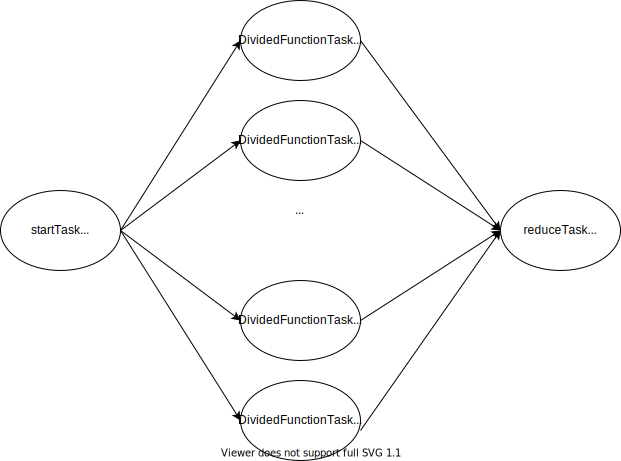

# Quick Start

This Quick Start will give you information on how Taskus works and how can you build a multithreaded program in it.

## Task Pool

The Task Pool must be always initilized first, it's the core of Taskus and manages everything.
By default, it will create as many threads the system has (plus 2, for more efficiency while a couple of threads might be waiting for something).

After initiliazing, the threads are started and stopped manually by the user (except there's a internal error).

So the normal structure of a Taskus program looks like this:

```cpp
#include <iostream>
#include <Taskus.h>

int main(){
    Taskus::TaskPool tPool; //assume default thread count
    tPool.start();
    tPool.stop();
    return 0;
}
```

## Task

A Task is a abstract class that can be derived for your own purposes, the key concept is that the any Task class must always have this basic form:

```cpp
class ExampleTask : public Taskus::Task{
    public:
        void tryMutate(){
            //do mutation if needed
        }

        void runTaskFunction(){
            //do something in task
        }

};
```

A task must always be derived from the class Task from Taskus and have the functions **tryMutate** and **runTaskFunction** defined because they are virtual.

For more attributes and information about how Task works: [Task](Task.md)


## Adding Tasks together

Tasks can be easily added together using the += operator like this:

```cpp
    ExampleTask t1;
    ExampleTask t2;
    t1 += &t2;
```
The argument of the += is the pointer of the task to be added for simplicity.

The Task Flow will look like this:


*(t2 will execute after t1 executes)*

## Function Tasks

Function Tasks simplify the creation of Tasks by wrapping this concepts up to a class template (and it will subdivide the Function, 
for more performance).

A function Task can be created using the makeFunctionTask function and specifying the return type.

A task that return an int can be defined like this:
```cpp
auto ftask = Taskus::makeFunctionTask<int>(<function>, <args...>);
```

It is recommended to use **auto** on the variable type because the type itself can be kind of long and not very ergonomic for the developer. 

**Note:** If you don't want to return anything, you need to use Taskus::noReturn when using makeFunctionTask.

`<function>` is any functor class (for instance, a lambda function or a anything with the std::function class).

`<arguments>` is the function arguments but there is a caveat:

- if in the arguments there's a `std::vector`, the class will assume that the function will have to run multiple times (the size of the vector).

So if the function is:

```cpp
auto functor = [](int a, int b){return a+b};
```

and we create the function task like this:

```cpp
    std::vector<int> b_arg= {1,2,3,4,5};
    auto ftask = Taskus::makeFunctionTask<int>(functor, 3, b_arg);
```
What will happen is that the functionTask will assume that 3 is the argument a and is **constant** to every function call.

Because we supplied a vector, the function will run for 5 times for each element.

**Note:** If you wish to use a std::vector as an actual function argument, we must encapsulate it into another std::vector.

After creating the functiontask, it will not create any tasks yet. Because it needs to be divided first (according to maxArgumentsPerTask).

```cpp
    f_task->changeArgumentsPerTask(2);
    f_task->divideTasks();
```

After dividing the task, the Task flow will look something like this:



The most important elements here is the **startTask** and the **reduceTask**.

Functionally, **startTask** does nothing of it self, but serves as a entrypoint for the rest of the Taskus (the start of any taskflow must be contained by one task only).

**reduceTask** serves to take the results from *DividedFunctionTask* and put it in a single vector. If the FunctionTask has return type **Taskus::noReturn**, the EndFunctionTask will be replaced with a placeholderTask, for simplicity.

In summary: **startTask** is to add itself to the TaskPool or a TaskFlow and **reduceTask** serves to other tasks add into it.

Let's suppose we want to wait and get the result from the FunctionTask:

```cpp
    tPool.addTask(f_task);
    f_task->reduceTask->waitToFinish();
    for(int a : f_task->result) std::cout << a << "\n";
```

For more information about this: [FunctionTask](FunctionTask.md)


## Branch Task

A branch tasks is like a normal task, but it decides what branch of the TaskFlow it will run next.

It has a similiar Model as a Task with a added function in it:

```cpp
    class ExampleBranchTask : public Taskus::BranchTask{
        void tryMutate(){
            //mutations shouldn't happen here
        }
        int chooseBranch(){
            //logic to choose the branch
            return num;
        }
        void runTaskFunction(){
            //do something
        }
    }

```

a BranchTask can have as many branches as you want.

**IMPORTANT**: we can't add Tasks into it using the += operator, it is not a valid Task Flow. Instead we use the BranchTask::addTaskToBranch()


For more information about this: [Branch Task](BranchTask.md)

